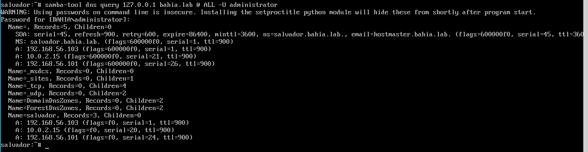
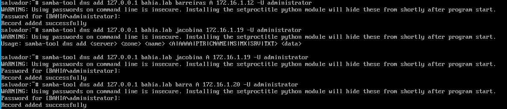
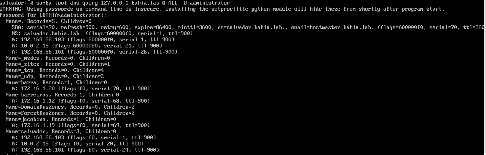

# Adicionando registros DNS tipo A com samba-tool

## Descrição da atividade

O objetivo desta atividade foi utilizar a ferramenta Samba-Tool para configurar quatro registros DNS do tipo A, associando cada um a um nome de host específico e seu respectivo endereço IP dentro da zona DNS estabelecida. Abaixo, apresento o passo a passo do processo de criação e listagem desses registros, bem como as verificações feitas para assegurar que foram adicionados corretamente.

---

## Primeiro passo: Configuração e verificação inicial para o DNS

É fundamental que o samba-tool esteja adequadamente configurado e que o Samba opere como um controlador de domínio, possibilitando a gestão do DNS.

- Instalando o samba


### Visualizar os registros 

Para visualizar os registros DNS existentes na zona configurada, o seguinte comando foi executado:

```
samba-tool dns query 127.0.0.1 "bahia.lab" @ ALL -U administrator
```

Esse comando exibe todos os registros DNS disponíveis na zona bahia.lab e solicita a senha do usuário administrador para realizar a autenticação.

### Imagem dos registros:

- **Adição de hosts:**:
  

---

## Segundo passo: Adicionar registros do tipo A

Três registros DNS do tipo A foram criados, com cada comando vinculando um nome de host a um endereço IP específico na zona bahia.lab.

### Registro: barreiras.bahia.lab

Associando o nome do host `barreiras` ao endereço IP `172.16.1.12`:

```
samba-tool dns add 127.0.0.1 bahia.lab barreiras A 172.16.1.12 -U administrador
```

### Registro: jacobina.bahia.lab

Associando o nome do host `jacobina` ao endereço IP `172.16.1.19`:

```
samba-tool dns add 127.0.0.1 bahia.lab jacobina A 172.16.1.19 -U administrador
```

### Registro: barra.bahia.lab

Associando o nome do host `barra` ao endereço IP `172.16.1.20`:

```
samba-tool dns add 127.0.0.1 bahia.lab barra A 172.16.1.20 -U administrador
```

### Imagem de adição dos hosts:

- **Adição de hosts:**:
  

---

## Terceiro passo - Conferir os registros adicionados

Após a adição dos registros, o comando a seguir foi utilizado novamente para verificar todos os registros na zona:

```
samba-tool dns query 127.0.0.1 "bahia.lab" @ ALL -U administrator
```

Tal comando possibilita a listagem dos registros, garantindo que os novos registros do tipo A foram adicionados corretamente.

---

### Imagem da listagem dos hosts:

- **Listagem dos hosts hosts:**:
  


## Conclusão

Os registros DNS do tipo A foram criados com sucesso para a zona bahia.lab, associando os endereços IP correspondentes aos nomes de host especificados. A verificação final confirma que os registros foram adicionados corretamente, como demonstrado na listagem de registros obtida após a execução dos comandos.
